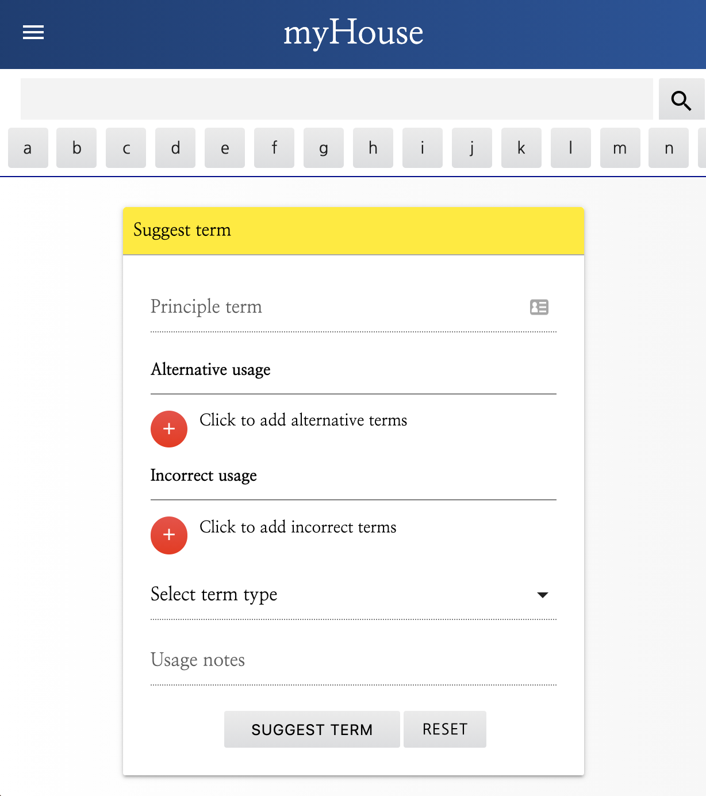

# myHouse
## A House Style Guide Management Tool for Publishers
### Milestone 3 Project

#### View this project at: https://ms3-myhouse.herokuapp.com/

To view the site at every access level, three user accounts have been set up:
- Administrator level
> - username: CIadmin
> - password: ciadmin
- Read & Comment level
> - username: CIcomment
> - password: cicomment
- Read-only level
> - username: CIread
> - password: CIread

View the GitHub repository at: https://github.com/mcglasp/ms3 

DISCLAIMER: This project was posted for peer review in the Code Institute's Peer Review Slack channel. It is therefore possible that content has been added to the site since submission that is beyond my control. I therefore can take no responsibility for any content that appears on the site after 9th June 2021.

## Strategy
-----
### What is it?
myHouse is a tool for the storage and management of a text-use style guide. A house style guide is a reference document used by organisations to explain how language should be used in company publications. 
It brings consistency to the spelling and grammar used on any publicly available or company-endorsed publication, be it a book, an article, a blog-post or marketing material. In particular it can offer clarity on less-commonly used words, such as those found in niche markets; technology, say, or any fast-moving industry, but there are also examples of this in everyday language. Consider 'co-ordinate', for example, which is also commonly written as 'coordinate'. As technology, in particular, moves forward it offers ever-more phrases now in common usage that are yet to settle into an accepted spelling. For example, 'web site', 'website' or web-site'; 'internet' or 'Internet'. And, recently, 'Covid-19' or 'COVID-19'?

Sound On Sound magazine is a leading music-technology magazine for which I have been Production Editor for a number of years. In that role I find numerous examples of spelling and grammar inconsistencies which should have been dealt with by the editor who commissioned a particular article. When exploring why this was I discovered that each editor was using a different version of the style guide, which they had converted into a PDF and saved on their desktop, thereby totally undermining the purpose of having a style guide. 
For want of a more appropriate tool I converted this into a searchable, shared, document using Google Sheets. However, I found that my colleagues were reluctant to use Google Drive and would also frequently break the tool when attempting to update it. Time was that the Editorial office shared their working space and a physical printed copy was kept on the shelf, but time has moved on, and with home working now standard, a better solution was needed.

myHouse is web-hosted, and therefore easily accessible and understandable to even the most Luddite of editorial staff. Content is controlled by one or more administrators, with staff members able to make term-use suggestions (for administrative approval) and discuss specific language use below individual terms. Read-only access is made available to freelance authors external to the organisation, so that they are able to check directly how Sound On Sound use a term without either bothering their editor or simply taking a guess. 
This should considerably reduce editing time, which should in turn reduce proof-reading time.

### User Stories

Sam Inglis is the Editor of Sound On Sound magazine. I discussed the requirements, as he sees it, of an online style-guide tool. He said:
> "Our house style guide needs to be comprehensive, accurate, easy to use and responsive to the needs of individual editors. It should be 
searchable and return useful results even when incomplete or mis-spelled terms are entered. It should be possible to ‘pin’ commonly needed or frequently mistaken terms to a dashboard. 
It should be easy for administrators to add to and update." 
- *Sam Inglis, SOS Editor In Chief, 2021*

In discussion with other editors and external authors, and based on my own experience of the needs of the SOS editorial process, the following are the key user stories for this tool, broken down into three user categories:

- Administrators: Key staff members such as myself and the Editor In Chief, who manage and curate the house style guide.
- Staff Editors: Daily users and stakeholders of the style guide.
- All external authors: Occassional users of the style guide as a reference document.

#### All (including external authors)

- As a user I want to be able to search for and read terms directly from the dashboard
- As a user I want to pin terms to my personal dashboard, and delete those pinned terms from the dashboard with a single click
- As a user I want to be able to change my password easily

#### Administrators
- As an administrator I want to be able to create, update and delete terms and user accounts from within two clicks of the dashboard
- As an administrator I want activity notifications to appear on my dashboard
- As an administrator I want to be able to access and deal with relevant activity directly from the notification
- The Sound On Sound style guide is a confidential document, as an Administrator I want it to be password protected and only available to approved users

#### Staff
- As a staff member I want to be able to view recently updated terms from my dashboard [also applicable to external authors]
- As a staff member I want to be able to view recent comments from my dashboard and click through to them to make comments myself
- As a staff member I want to be able to comment on existing terms within a single click of searching for that term
- As a staff member I want to be able to easily suggest new terms for inclusion to the administrators

### Competitors
In my role as Production Editor for Sound On Sound magazine I have been unable to find an existing tool that does what we require, even in a more basic form. I have tried using Wiki software with varying results, and have found nothing with the advanced levels of functionality as listed above.

At its most basic, however, our simple text document was a worthy competitor for many years and as such there has been a reluctance to move away from this. However, as working practices have changed beyond recognition, house style management has suffered and it is no longer sufficient to update users via email or phone of every single change.

----
## Scope

### Potential features to include

### What is realistic for a minimum viable product?

Looking at the Importance/Feasibility matrix show here, we can see a cluster of essential features, mainly related to basic CRUD (Create, Read, Update, Delete) functionaility, as you'd expect. 
Other features of high importance for inclusion relate to essential management of such an application. Namely, the ability to control who is able to register and view content, which in many cases (and in the case of Sound On Sound) is confidential. 
Also of high importance is the capacity for non-admin users to suggest terms for inclusion, or to comment on existing usage.

----
## Structure

There are three access levels which determine what is available to each user:
- Administrator
- Read & Comment (Mainly staff editors)
- Read-only (Mainly external authors)

After logging in all users will be directed to a dashboard with relevant notifications and a search bar at the top of the main content, below navigation. They will be able to search for a specific term or browse from an alphanumeric list.
The search and browse functionality will be available across all pages, so users will be able to perform a search from any part of the application.

Space to search and view results is the absolute priority for this tool and therefore, on the mobile view, notifications will be accessed via a sidenav component. 

'Pinned' terms will be available alongside notifications, whether in mobile or desktop view. These terms will be selected by the individual user depending on which terms they most regularly search for. The user will be able to click through to the full term usage from the 'pin'.

Administrators will be able to access a user-management page, from which they can search for a user, change that user's access level, or delete the user account entirely. They will also be able to create a new user from here.

From the main navigation Administrators will be able to add a term, while for Read & Comment users this will change to 'Suggest term'. Neither functionality will be available to Read-only users.

MongoDB will be used to store the data. It will be necessary to divide storage into at least the following listed Collections:

- Terms [term name, alternative usage, incorrect usage, usage notes, type, pending approval, created by, last updated by]
- Users [username, password (encrypted), access level, pinned terms]
- Comments [Related term ID, commenter, flagged?]
- Access Levels [Level name]
- Types [type name (verb, noun etc)]
----
## Skeleton

### Wireframes

-----

---
## Surface

The surface design for myHouse must be simple and professional. This is not an appropriate space to explore the wonders of CSS animation or Javascript tricks. The core content and functionality must be given priority and must be readable and clear. 
As I have built apps using Bootstrap in the past, I decided to base the site on Materialize CSS for this project in order to familiarise myself with the design language and strengthen my skillset as a developer.
I looked to existing online dictionaries for inspiration and was surprised by the amount of on-screen clutter I found. This makes sense for a number of those organisations, of course, whose business model depends on including content extending far beyond dictionary definitions, but it did underscore the need for myHouse to be clear and unafraid or white space. This is not a tool which needs to advertise other features or draw users in; it must be wholly undistracting. I considered implementing the ability to customise the tool to an organisation's brand colours, but this seemed an unnecessary distraction to my core aims and also risked making the tool less accessible in cases where colour schemes and font were inappropriate for the purpose of clarity or did not meet accessibility standards. I settled on a simple blue theme, highlighted with yellow headers, grey buttons and red for floating action buttons. I applied subtle gradients to add interest.

---

## Build

### Technologies & Libraries used

- Python
- HTML & CSS
- Javascript & jQuery
- Flask & Jinja
- MongoDB
- Materialize 

### User story testing

- As a user I want to be able to search for and read terms directly from the dashboard

The search field is always accessible at the top of every page in both desktop and mobile views.

- As a user I want to pin terms to my personal dashboard, and delete those pinned terms from the dashboard with a single click

The user's homepage (their 'dashboard') is the first page loaded after login and displays their personally 'pinned' terms. 
The term itself is a link to more information on that term's usage and the cross deletes the pin from the dashboard and removes it from the user account in MongoDB.

- As a user I want to be able to change my password easily

A single click takes the user to their Profile page, where they can immediately access the Update Password form.

- As an administrator I want to be able to create, update and delete terms and user accounts from within two clicks of the dashboard

To create a term, the user clicks 'Add term' from the navigation page. To update a term they search for that term, click on it, then click the 'Manage term' button. From here they can also delete that term.
To access the same CRUD functionality for user accounts, the user accesses all these functions from a single 'Manage users' page, accessible via the navbar.

- As an administrator I want activity notifications to appear on my dashboard

Administrators have a dedicated notifications panel, which shows new user registrations (and the option to set their access level), new term suggestions, and flagged comments.

- As an administrator I want to be able to access and deal with relevant activity directly from the notification

Administrators can click straight through to the relevant data from the notification, rather than have to search for it.

- The Sound On Sound style guide is a confidential document, as an Administrator I want it to be password protected and only available to approved users

The login and registration pages are all that is accessible to those not yet registered. Those who wish to view the style guide must register and wait for their account to be verified by an administrator. 
The administrator sets the new user's level (or deletes their registration, if applicable). If the user account was created manually by the administrator themselves, the new user is directed to change their password. 
Until they do so, for their own security they are not allowed full access to the application.

- As a staff member I want to be able to view recently updated terms from my dashboard [also applicable to external authors]
Editorial staff (read & comment) and external authors (read-only) are shown a 'recent updates' panel on their dashboard, which lists any recently updated or created terms. They can click through to the terms from the dashboard.

- As a staff member I want to be able to view recent comments from my dashboard and click through to them to make comments myself

Read & comment users can see recent comments made by other users and the terms about which those comments were made. They are able to click through to the term to leave their own comment.

- As a staff member I want to be able to comment on existing terms within a single click of searching for that term

Read & comment users can view the term they have searched for by either clicking on the search result's header or clicking the 'View term' button. They then have the option to leave a comment directly below the term in the comment box.

- As a staff member I want to be able to easily suggest new terms for inclusion to the administrators

Read & comment users have the option to 'Make a suggestion' from the navbar. This is a duplicate of the 'Add term' function available to administrators, but displayed under a different name for read & comment users. 
It uses the same function to interact with MongoDB but, if the entry is made by a non-admin user, it is given the 'Pending' status of 'True' and displayed to an administrator as a suggested term. 
It will not show up in search results until it has been added by an administrative user at which point its Pending status changes to False.

---
## Testing plan

The following functions will be tested under each access level (where applicable):
- Create (or suggest), read, update, delete term
- Create, read, update, delete user
- Create, delete, flag comment
- Remove flag
- Pin term, remove pin
- Register as user
- Update password
- Navigate through notifications
- Check for suitable 404 handling where appropriate (a dummy, incomplete, record will be manually created for this purpose and deleted prior to project submission)

Each of the above actions will be tested in both desktop and mobile views, using actual hardware (as opposed to developer tools), where available.

### Testing outcomes

- Create (or suggest), read, update, delete term

**Expected behaviour**: Content of all fields added to should be sent to the database and accessed correctly when a search is performed.

Found behaviour: after creating a term the alternative or incorrect usages where not showing up. I found that these were not being saved correctly on creation. 
To test where the problem was coming from I printed the result in the relevant functions (Add term, View term and Update term) and discovered that this was 
only working correctly for adding Incorrect usage when updating the term. 

Solution: After some research I discovered that this was down to a simple typo in the JavaScript 
function that added the input fields which the Python code referenced to update the MongoDB record. Once this was fixed all functions behaved as expected.

**Expected behaviour**: Searching for a 'Pending' term should return the result 'Your search did not return any results'.

Found behaviour: The search actually resuts in an empty string (in practice, nothing appears). As the term is being successfully found, but not displayed, the '... no results' response is overridden.
Solution: I added a line of code in the Jinja template to identify if there was a single result and if that result had a Pending status of True. If so, the '... no result' would display.

**Expected behaviour**: A term search including punctuation (for example, a hyphen) should return a result that does not include punctuation, where the non-puncuated version is correct.

Found behaviour: Searching for 'stand-alone' threw an error which indicated that an invalid Regex search had been performed. It seems that some punctuation was not always being correctly escaped during the search. 
Solution: A section of code in the Text Search function strips all punctuation, so I changed the regex portion of the code to search for the punctuation-stripped text, rather than the raw user query, to reduce the possibility of that error occuring.

**Expected behaviour**: When a term is deleted from the database, all references to that term that appear in other records should be deleted. For example, if I have pinned the term 'standalone' to my dashboard and that term is then deleted, the Object ID of that term should be deleted from the 'pinned terms' array in my user record.

Found behaviour: When a term was deleted, that term would no longer show up as a pin on a user's dashboard. However, the Object ID of that term remained in the user's record; it was simply no longer being looked up and referenced by it's term name on the application's front end (the dashboard). It's good that the error was recognised and dealt with in the Python code, but it's messy to leave a reference in the database which no longer relates to an existing record.

Solution: I comprehensively rewrote the search function to find a range of results rather than only one, and also strips punctuation from the query if a result is not found immediately.

- Create, read, update, delete user

**Expected behaviour**: The administrator should be able to click the 'Delete user' button on an individual user's card and have that user account be instantly deleted.

Found behaviour: The delete function was simply deleting the very top user listed.

Solution: The user ID required to correctly identify which user to delete was not being passed correctly to the 'delete_user' function. I had implemented a modal which is called when you press the Delete User button. 
In theory, confirming that you wish to delete the user by pressing the 'Yes, delete' button on the modal should trigger the function. However, I needed to add a variable to the data-target attribute and match that in the modal's ID in order to pass the variable through the modal and correctly on to the function. Credit for this solution goes to Stackoverflow user Adrianopolis.

**Expected behaviour**: No users should show up in the results list until the user has entered a search query or selected 'Show All'.

Found behaviour: All users where being listed by default, before user interaction.

Solution: The default value of the variable 'users_list' was set to 'None'. This is overridden by either a user query or by clicking the 'Show All' button.

Minor UX error encountered: the 'Delete user?' modal displays below the navbar and search fields. 

- Create, delete, flag comment

Working as expected.

- Remove flag

Working as expected.

- Pin term, remove pin

Working as expected.

- Register as user

**Expected behaviour**: A newly registered user should not be granted access until confirmed by an Administrator.

Found behaviour: The newly registered user was permitted immediate access to the app without having to wait for approval.

Solution: Code was inputted into the Jinja template to ensure that users could not access the app if their access level was still set to 'requested'. Once the administrator updates this, access is granted.

*In identifying the above problem, a further issue was found. The button to update the access level for new registrations that appears in the sidenav was not working properly. It had the same code as for 
the desktop notification section, though it was never intended to work in the same way due to space contraints. The desktop button allows the Administrator to select and set an access level directly from their 
dashboard, but there is not space to do this on the mobile view. Instead I fixed the sidenav button so that it took the user to the Manage Users page, and wrote a custom query into the code to make the newly 
registered user's details appear, to save the Administrator from having the perform the query themselves.*

**Expected behaviour**: A user account which has been newly created by an administrator should not be given access to any content until they have changed their password.

Found behaviour: After login the 'Make a suggestion' option was available on the navbar and the user was able to click through to that function.

Solution: An if statement was added using a Jinja template to identify whether a user's status is still 'To Change Password'. 
If it is, only the Log out and Profile options will be available to them and a message will appear on the dashboard asking them to change their password, with a link through to the Profile page in order to do so. 
Once their password is changed all access-level-appropriate content becomes available.

- Update password

Worked as expected. However, see 'future development' section for more detail.

- Display and navigate through notifications

**Expected behaviour**: Recent comments should display in the correct order.

Found behaviour: Recent comments are not displaying correctly.

Solution: I discovered that sorting by timestamp did not work as expected. With some research I found that timestamps are essentially 'baked into' MongoDB ObjectIds, so sorting by ID was the solution.

### General
All buttons and links should perform correctly in all views and at all access levels.

#### Updated functionality for access level updates
In the course of testing I discovered that, as an Administrator, I was able to update the access level of my own user account. 
This meant that I was able to (and did) accidentally change my own access to that of a non-admin and essentially lock myself out of some essential, admin-only features. In that instance I was able to change this manually via MongoDB, but to prevent future users from encountering this issue I have disabled this ability where the current user ID matches that of the ID related to the displayed account. 
In other words, if you are logged in as user 'Admin', you cannot change the access level of an account whose ID matches that of user 'Admin'.

#### Improving the search function

MongoDB includes an accurate text search, available natively by creating an index on your chosen field. This works well and it can be set to search multiple fields. 
For example, I had good results applying it to the Term Name, Incorrect Usage and Alternative Usage fields. The drawback to using this approach alone is that it can 
only find what is there, and only when the user types an accurate and full query and finds and accurately typed and full record.

In other words, if I were to look up 'Plug in', for which the correct term was 'plug-in', it would return the correct result so long as I had included my incorrect 
search term in the 'Incorrect terms' field when entering the term in the database.
If I hadn't included that when adding the term to the database, however, I'd probably be served an empty result.

To improve matters I have written a more comprehensive text search function, which takes the user's search query through several iterations, testing to see if it can 
finding any matches along the way. It also sorts the results into a set, which automatically removes duplicates, and moves the more accurate results to the front of the set. 
If, however, this search function delivers an empty result, the standard search function is performed, and then, finally, the user query is updated by stripping out punctuation 
and the extended and standard searches are performed once more. A future development of this feature would be to reformat the code considerably to perform these 
functions more efficiently and more quickly, and also identify a preferred hierarchy to the order in which the various types of searches are performed.

## Security issues

Once the project was 90% complete I met with my mentor to look over the app. He was able to circumvent site security in a couple of crucial ways:

**Expected behaviour**: A user should only be able to make changes to their own account.

Found behaviour: My mentor was able to change the password of another user via the change password form on his own account. He simply typed in the other user's username and 
used his own account's credentials to validate it, then changed the password of the inputted account to one of his choosing. This meant that, as a read-only user, 
for example, he was able to take control of the Administrator's account.

Solution: Though this appeared to be a major flaw, the easy fix was simply to remove the username field on the form, thereby removing the possibility of linking the change of password to the wrong account.

**Expected behaviour**: A logged-out user should not be able to access pages available only to logged-in users.

Found behaviour: My mentor was able to access parts of the site that should have been inaccessible to him by manually guessing at the correct url. 
In 90% of cases this would result in an error being thrown, but it leaves open the possibility that a user could access the app without an account.

Solution: With the help of my mentor I added a function to check for the presence of a user session cookie. If none is found, the site redirects to the login page. 
This was added to all pages of the site that require a user to be logged in.

### Future development & Existing Bugs

The most useful feature for future development would be a bulk-upload tool accessible from the front-end. This would likely require some kind of CSV-to-JSON conversion. 
This is one reason I have deliberately left most of the term fields as optional; this increases flexibility and allows users to 
input their existing data as quickly as possible, without having to fill it out first with fields they may not previously have needed.

The Safari browser appears not to correctly display a few small elements. Namely the pins, the browse button and the alert icon. They appear to be jumping out of their containers.
This is a minor UI issue and does not impact on usability.

#### Flash messages behaviour across different browsers

The flash messages work well throughout the site where a user is logged in. However, I have encountered a bug when attempting to invoke flash messages on the 
Register and Login pages, and when logging out. In Chrome these behave as expected: for example, trying to register an 
already-existing username results in a flash message on the Register page. In Firefox and Safari, however, they do not always show up until a user has logged in. 
For example, if a user were to enter incorrect login details, they should receive a notification of this. In some cases in the aforementioned browsers, 
however, I have found that these messages do not appear until after the user has logged in successfully. I have been unable to reliably recreate this behaviour up until this point,
so it therefore remains a known issue.

### The Joy of Checks; Validating the Code

The HTML validator found at validator.w3.org is usually a five-minute visit. Not so on this occassion. I validated each page of my website at each access level by direct input, taking the code from the source code available via dev tools.
it passed in every instance. However, one issue plagued me, my tutors and the good folks on Slack for a full two days. A stray div tag would rear its ugly head from time to time only to disappear just as 
quickly. The first occassion alerted me to an issue surrounding how I had placed a grid row around the block content and endblock tags. Some painstaking work fixed each of these until it was once again fixed.
However, depending on the method of validation, who was attempting validation and the temperature outside, there was no telling whether it would pass.

What I can say, however, is that at 7.24pm on Friday 11th June 2021, there were **no validation errors on any page, at any access level**.

I can also confirm that at this point it passes through CSS validators, JS linters and PEP8 compliance checkers without issue.

### Accessibility testing

I tested the accibility of the site using the tool on webaim.org. I've used this several times before without issue, but on this occassion 
I found it was unable to assess custom CSS that had been applied to Materialize element and instead assessed only the basic Materialize CSS styles before customisation. For example, the standard navbar
element is a light pink colour and I had changed the site heading text colour to white. This resulted in a very poor accessibility assessment due to the low contrast difference between the two colours.
In reality, of course, the navbar is a dark blue, giving very high contrast, well within accessibility standards.

----
## Deployment

I used Heroku to deploy this project. To do so it was necessary to go through the following procedure:

- In the terminal type the following: 
    - pip3 freeze --local > requirements.txt
        - *Press return to complete the command*
    - echo web: python run.py > Procfile
        - *Press return to complete the command*

The above steps are critical to successful deployment through Heroku as they convey essential information to Heroku.

- 'Create New App' from the Heroku dashboard
- Connect the app to GitHub via the Deploy tab, selecting 'GitHub' from the Deployment method section and selecting the relevant repository
- From Settings, select 'Reveal Config Vars' and fill in the following information:
    * IP, MONGO_DBNAME, MONGO_URI, PORT, SECRET_KEY
- From the Deploy tab, select 'Enable Automatic Deployment'

#### Forking the GitHub Repository

- Log in to GitHub and locate the GitHub Repository
- At the top of the Repository, locate and click the Fork button.
- After a moment the forked repository should appear in your GitHub account

#### Making a Local Clone

- Log in to GitHub and locate the GitHub Repository
- Under the repository name, click 'Clone or download'
- To clone the repository using https, copy the link under 'Clone with https'
- Open Git Bash
- Change the current working directory to the location where you want the cloned directory to be made
- Type git clone, and then paste the copied URL
- Press Enter

---
## Resources

I used the online resources below for general guidance and solutions to specific problems. Coding solutions are also signposted in the code.

- Code Institute Full Stack Development course material, mentor and tutors.
- Slack community (general guidance and peer review)
- Stack Overflow website
- W3 Schools (specific code examples and tutorials)
- The Responsinator (check responsiveness)
- AmIResponsive (check responsiveness)
- Autoprefixer CSS online (increase compatibility across browsers)
- Jigsaw and W3 Schools (code validators)
- JShint (Javascript code quality checker)
- Google Chrome (developer tools)
- Webaim.org (accessibility guidance)
- favicon.io (favicon generator)

### Acknowledgments

I would like to thank my mentor Antonio Rodriguez for his time and patience in guiding me through this project.

I would also like to thank Sam Inglis and the rest of the staff at Sound On Sound magazine for their help in shaping the core features included in this project.

The Stackexchange and Stackoverflow community remain an essential resource and I have learnt much from them during the course of completing this milestone project.